# Welcome to my homelab monorepo~

Here you will find all of my infrastructure-as-code, GitOps, and scripts that I currently run in my Homelab.

There are `README.md` files with further explanations in folders, so I recommend browsing this repo using the github.com website as it renders the readmes neatly while browsing the folders.

The folowing order is canon when I re-create my homelab:
>  - [ansible/](https://github.com/frealmyr/homelab/tree/main/ansible)
>  - [terraform/](https://github.com/frealmyr/homelab/tree/main/terraform)
>  - [gitops/](https://github.com/frealmyr/homelab/tree/main/gitops)
> - [charts/](https://github.com/frealmyr/homelab/tree/main/charts)

I might also add relevant posts on my blog over at https://docs.fmlab.no when I finish nerding nerding on something.

---

My vision for this homelab is to provide a dual purpose for a single, power-efficient server:

  - Hosting services for everyday use using docker containers directly on the host.
    - For maximum uptime, without getting affected when I nuke the libvirt clusters for the 100th time.
    - It is way easier to backup docker volumes to my Synology NAS.
  - Having a flexible VM-based Kubernetes playground using LibVirt, for testing out different tooling and configurations on multiple clusters.
    - The current goal is to have a management, testing and production cluster. For simulating a production grade microservice deployment pipeline for my aspiring backend developer girlfriend. 👩🏻‍💻

---

Gaze upon this visual masterpiece of a flowchart, which illustrates my plan for connecting to different services within my Homelab.

```mermaid
flowchart LR

  subgraph kubernetes [Kubernetes LibVirt VMs]
    subgraph node-mgmt [Management VM]
      mgmt-metallb(metallb) --> mgmt-traefik((traefik))
      mgmt-traefik -- "argocd.mgmt.fmlab.no" --> argocd(ArgoCD)
      mgmt-traefik -- "argo-rollouts.mgmt.fmlab.no" --> argo-rollouts(Argo Rollouts)
    end
    subgraph node-test [Test VM]
      test-example-frontend(example-frontend) --> test-example-backend(example-backend)
      test-metallb(metallb) --> test-traefik((traefik))
      test-traefik -- "example-frontend.test.fmlab.no" --> test-example-frontend
    end
    subgraph node-prod [Prod VM]
      prod-example-frontend(example-frontend) --> prod-example-backend(example-backend)
      prod-cloudflare-sidecar(Cloudflare Sidecar)  --> prod-example-frontend
      prod-example-frontend(example-frontend) --> prod-example-backend(example-backend)
      prod-metallb(metallb) --> prod-traefik((traefik))
      prod-traefik -- "example-frontend.prod.fmlab.no" --> prod-example-frontend
    end
  end

  subgraph docker [Docker directly on host]
    direction LR

    traefik((traefik))

    subgraph home [Home]
      direction TB
      hass[Home Assistant]
      homebox[Homebox]
      upsnap[UpSnap]
    end

    traefik -- "homeasssisant.fmlab.no" --> hass
    traefik -- "homebox.fmlab.no" --> homebox
    traefik -- "upsnap.fmlab.no" --> upsnap

    subgraph network [Network]
      direction TB
      librespeed[Librespeed]
      omada[Omada]
      adguard[AdGuard]
    end

    traefik -- "librespeed.fmlab.no" --> librespeed
    traefik -- "adguard.fmlab.no" --> adguard

    subgraph entertainment [Entertainment]
      direction TB
      jellyfin[Jellyfin]
      sonarr[Sonarr]
      transmission[Transmission]
    end

    traefik -- "jellyfin.fmlab.no" --> jellyfin
    traefik -- "sonarr.fmlab.no" --> sonarr
    traefik -- "transmission.fmlab.no" --> transmission
  end

  lan((LAN))
  lan -- "192.168.0.20" --> traefik
  lan -- "192.168.0.20:6443" --> omada
  lan -- "192.168.0.120" --> mgmt-metallb
  lan -- "192.168.0.121" --> test-metallb
  lan -- "192.168.0.122" --> prod-metallb
  wan((WAN)) -- "0.0.0.0/0" --> cloudflare-proxy(Cloudflare Proxy)
  prod-cloudflare-sidecar -- "example-frontend.fmlab.no" --> cloudflare-proxy
  vpn(VPN\nTailscale) -.-> lan

  style kubernetes fill:#282A36;,stroke-width:0px,padding:100px
  style node-mgmt fill:#44475A;,stroke-width:0px
  style node-test fill:#44475A;,stroke-width:0px
  style node-prod fill:#44475A;,stroke-width:0px
  style docker fill:#282A36;,stroke-width:0px,padding:100px
  style home fill:#44475A;,stroke-width:0px
  style network fill:#44475A;,stroke-width:0px
  style entertainment fill:#44475A;,stroke-width:0px
```

