Welcome to my homelab monorepo~

Here, you will find all of my infrastructure-as-code, GitOps, and scripts that I currently run in my Homelab.

My vision for this homelab is to provide a dual purpose for a single, power-efficient server: hosting services for everyday use using docker-compose directly on the host and having a flexible VM-based Kubernetes playground for testing out tooling and configurations.

Gaze upon this visual masterpiece of a flowchart, which illustrates my plan for connecting to different services within my Homelab.

```mermaid
flowchart LR

  subgraph kubernetes [Kubernetes VMs]
    subgraph node-mgmt [Management VM]
      direction LR
      argocd(ArgoCD)
      argo-rollouts(Argo Rollouts)
    end
    subgraph node-test [Test VM]
      direction LR
      test-example-api(example-api) --> test-example-backend(example-backend)
      test-metallb(metallb) --> test-example-api
    end
    subgraph node-prod [Prod VM]
      direction LR
      prod-example-api(example-api) --> prod-example-backend(example-backend)
      prod-cloudflare-sidecar(Cloudflare Sidecar) --> prod-example-api
    end
  end

  subgraph docker [Docker-Compose on host]
    direction LR

    subgraph home [Home]
      direction TB
      hass[Home Assistant]
      homebox[Homebox]
      upsnap[UpSnap]
    end

    subgraph network [Network]
      direction TB
      librespeed[Librespeed]
      omada[Omada]
      adguard[AdGuard]
    end

    subgraph entertainment [Entertainment]
      direction TB
      jellyfin[Jellyfin]
      sonarr[Sonarr]
      radarr[Radarr]
      prowlarr[Prowlarr]
      transmission[Transmission]
    end
  end

  lan((LAN)) --> node-test
  lan --> home
  lan --> network
  lan --> entertainment
  lan --> node-mgmt
  wan((WAN)) --> cloudflare-proxy(Cloudflare Proxy)
  cloudflare-proxy -.-> prod-cloudflare-sidecar
  vpn(VPN\nTailscale) -.-> lan

  style kubernetes fill:#282A36;,stroke-width:0px,padding:100px
  style node-mgmt fill:#44475A;,stroke-width:0px
  style node-test fill:#44475A;,stroke-width:0px
  style node-prod fill:#44475A;,stroke-width:0px
  style docker fill:#282A36;,stroke-width:0px,padding:100px
  style home fill:#44475A;,stroke-width:0px
  style network fill:#44475A;,stroke-width:0px
  style entertainment fill:#44475A;,stroke-width:0px
```

I place readmes under each folder if you are curious to how this is all configured, I recommend the visiting them in the following order:
  - [ansible/](https://github.com/frealmyr/homelab/tree/main/ansible)
  - [terraform/](https://github.com/frealmyr/homelab/tree/main/terraform)
  - [charts/](https://github.com/frealmyr/homelab/tree/main/charts)
  - [k8s/](https://github.com/frealmyr/homelab/tree/main/k8s)

